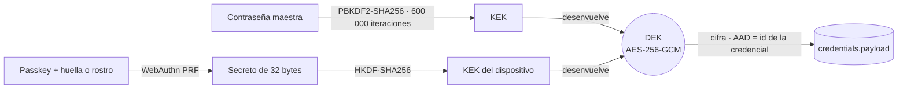

<div align="center">


# Bóveda

**Las credenciales de todos tus clientes, en un solo lugar y a un atajo de distancia.**<br />
Cifradas antes de salir de tu navegador.

[](LICENSE)
[](https://github.com/yairhdz24/boveda7k/actions/workflows/ci.yml)


[English](README.md) · **Español**


</div>

## La historia

Eres freelance. Tienes muchos clientes, y cada uno trae su Gmail, su hosting, su Tag Manager, su base de datos y su servidor. Terminas con una nota por cliente, contraseñas enterradas en chats de WhatsApp y diez minutos perdidos cada vez que necesitas entrar a algo.

**Bóveda hace lo contrario.** Creas al cliente, le vas enlazando las cuentas de cualquier servicio y cualquier credencial queda a un `⌘K` de distancia. Todo se cifra en tu navegador: ni la base de datos ni quien la administra pueden leer una sola contraseña.

| Antes | Con Bóveda |
| --- | --- |
| Una nota suelta por cliente | Un cliente, todas sus cuentas, con logo y entorno |
| Contraseñas en chats de WhatsApp y correos viejos | AES-256-GCM en tu navegador; el servidor solo ve texto cifrado |
| Diez minutos buscando un acceso | `⌘K`, escribes dos letras y copias |
| "¿Con qué correo entraba a esto?" | Cuentas enlazadas: *inicia sesión con* la cuenta de Google del cliente |
| Teclear la contraseña maestra todo el día | Touch ID, Face ID o Windows Hello |

## Capturas

| | |
| --- | --- |
|  **Un cliente, todos sus accesos** |  **`⌘K`: busca y copia sin abrir nada** |
|  **Desbloqueo con biometría** |  **Dispositivos autorizados, revocables** |
|  **Tus clientes** |  **Más de 180 servicios con logo y plantilla** |

<div align="center">


**Instalable como app en el teléfono**
</div>

Todas las capturas usan los datos ficticios de `npm run seed:demo`.

## Características

- **Clientes** con logo, sitio y notas. El logo se busca en [SVGL](https://svgl.app), se sube o se toma del favicon.
- **Catálogo de servicios**: más de 180 plataformas (Google, Meta, Supabase, Vercel, Cloudflare, Hetzner, Stripe…) con URL de acceso y plantilla de campos según el tipo: cuenta, correo, base de datos, servidor SSH o API.
- **Credenciales** por cliente y servicio, con entorno (Producción / Staging / Dev), campos libres, generador de contraseñas y notas cifradas.
- **Cuentas enlazadas**: marca que Tag Manager "inicia sesión con" el Gmail del cliente y los atajos copian el usuario y la contraseña correctos.
- **Panel lateral**: el detalle se desliza desde un lado (o desde abajo en móvil) sin perder el contexto.
- **Desbloqueo biométrico** con passkeys, sin debilitar el cifrado ([cómo funciona](#modelo-de-seguridad)).
- **`⌘K` / `Ctrl K`**: busca clientes y credenciales y copia la contraseña sin abrir nada.
- **Higiene automática**: lo revelado se oculta a los 20 s, el portapapeles se limpia a los 30 s, la bóveda se bloquea tras 15 min sin uso y avisa cuando una credencial lleva más de 90 días sin rotarse.
- **Temas Noche y Día**, instalable como PWA.

## Modelo de seguridad



- **Todo se cifra en el navegador.** Supabase solo guarda texto cifrado: ni la base, ni un respaldo filtrado, ni la service role pueden leer tus contraseñas.
- **La llave de datos (DEK) vive solo en memoria** y no es extraíble. Cambiar la contraseña maestra solo vuelve a envolver la DEK; no hay que recifrar nada.
- **La biometría no es un atajo inseguro.** Cada dispositivo registra una passkey; al verificarte, el autenticador entrega un secreto del que se deriva una llave que envuelve la misma DEK. Sin el dispositivo y tu huella o rostro, esa copia no sirve. Revocar un dispositivo borra su copia del servidor.
- **Si olvidas la contraseña maestra no hay recuperación.** Guárdala fuera de la app.
- **Lo que no se cifra** (para poder listar y filtrar): nombre, sitio y notas del cliente, nombre del servicio, y título, entorno y URL de acceso de la credencial. No pongas secretos ahí.
- **RLS en todas las tablas**: cada usuario solo ve lo suyo.

El modelo de amenazas completo y cómo reportar una vulnerabilidad están en [SECURITY.md](SECURITY.md).

## Inicio rápido

Necesitas Node 22+ y un proyecto de Supabase (el plan gratuito basta).

1. **Clona e instala**
   ```bash
   git clone https://github.com/yairhdz24/boveda7k.git
   cd boveda7k
   npm install
   ```
2. **Crea la base.** En tu proyecto de Supabase, pega en el SQL Editor, en orden, `supabase/migrations/0001_boveda.sql` y `supabase/migrations/0002_passkeys.sql`. Con la CLI: `supabase link --project-ref <ref> && supabase db push`.
3. **Crea tu usuario**: Authentication → Users → *Add user* (marca *Auto confirm*).
4. **Cierra los registros públicos**: Authentication → Sign In / Providers → desactiva *Allow new users to sign up*.
5. **Variables de entorno**
   ```bash
   cp .env.example .env.local
   # NEXT_PUBLIC_SUPABASE_URL y NEXT_PUBLIC_SUPABASE_PUBLISHABLE_KEY (Project Settings → API)
   ```
6. **Arranca**
   ```bash
   npm run dev          # http://localhost:3000
   ```
   Entra con tu cuenta, crea tu contraseña maestra y da de alta tu primer cliente.

### Sin cuenta de Supabase: todo en local

Con Docker y la [CLI de Supabase](https://supabase.com/docs/guides/cli):

```bash
supabase start        # levanta Postgres + Auth y aplica las migraciones
```

Copia la `API URL` y la `Publishable key` que imprime a `.env.local`, crea un usuario en Studio (`http://localhost:54323`) y arranca con `npm run dev`.

### Datos de ejemplo

```bash
# en .env.local: BOVEDA_DEMO_EMAIL, BOVEDA_DEMO_PASSWORD y BOVEDA_DEMO_MASTER
npm run seed:demo
```

Carga 4 clientes ficticios con 19 credenciales, cifradas con la contraseña maestra que indiques. Si el usuario ya tiene clientes, no hace nada.

## Despliegue

Vercel, o tu propio servidor con `npm run build && npm start`. Usa siempre HTTPS: Web Crypto, el portapapeles y las passkeys lo requieren. Si lo publicas en un VPS, protégelo además con Cloudflare Access o una lista de IP.

El desbloqueo biométrico queda ligado al dominio. Si cambias de dominio, entra con tu contraseña maestra y vuelve a registrar el dispositivo.

### Compatibilidad del desbloqueo biométrico

| Navegador | Estado |
| --- | --- |
| Safari 18+ (macOS 15, iOS 18) | Touch ID y Face ID |
| Chrome y Edge 116+ (macOS, Windows) | Touch ID y Windows Hello |
| Chrome en Android | Huella |
| Navegadores sin la extensión PRF | No disponible; la contraseña maestra funciona igual |

## Estructura del proyecto

```
supabase/migrations/0001_boveda.sql    tablas, RLS, vista de conteos, bucket de logos
supabase/migrations/0002_passkeys.sql  passkeys para el desbloqueo biométrico
src/lib/crypto.ts                      cifrado (PBKDF2, HKDF, AES-GCM), generador de contraseñas
src/lib/passkey.ts                     WebAuthn + PRF: lo único que toca navigator.credentials
src/lib/vault.tsx                      estado de la bóveda, auto-bloqueo, portapapeles, toasts
src/lib/data.ts                        acceso a Supabase (cifra y descifra credenciales)
src/lib/presets.ts                     catálogo de servicios y buscador de SVGL
src/components/CredentialCard.tsx      tarjeta compacta de credencial
src/components/CredentialDrawer.tsx    panel lateral con el detalle
src/components/SecurityDialog.tsx      dispositivos con desbloqueo biométrico
src/components/ui/                     Button, Field, SecretField, Dialog, Sheet…
src/app/tokens.css                     tokens del Design System Bóveda
src/app/tailwind.css                   Tailwind v4 conectado a esos tokens
scripts/test-crypto.mts                pruebas del cifrado
scripts/seed-demo.mts                  datos de ejemplo
```

## Hoja de ruta

- [ ] Exportar y restaurar un respaldo cifrado
- [ ] Compartir un cliente con un socio (envolver la DEK con su llave pública)
- [ ] Historial de cambios por credencial
- [ ] Códigos TOTP en vivo
- [ ] Extensión de navegador para autocompletar
- [ ] Interfaz en otros idiomas (hoy solo español)
- [ ] Terminar la migración de estilos a Tailwind + shadcn/ui

## Contribuir

Las contribuciones son bienvenidas: servicios nuevos para el catálogo, traducciones, correcciones e ideas de la hoja de ruta. Empieza por [CONTRIBUTING.md](CONTRIBUTING.md) y revisa el [código de conducta](CODE_OF_CONDUCT.md). Si encuentras un problema de seguridad, repórtalo en privado como indica [SECURITY.md](SECURITY.md).

## Licencia

[MIT](LICENSE). Hecho en México por Yair Hernandez.
