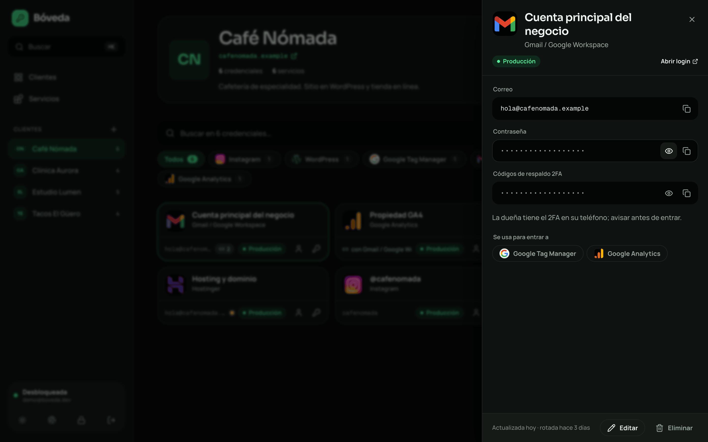
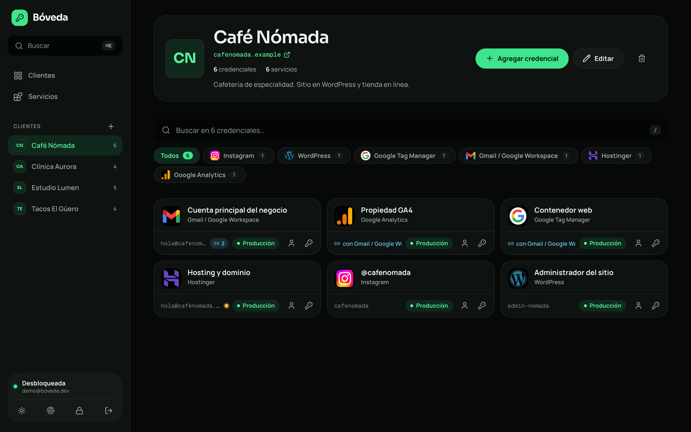
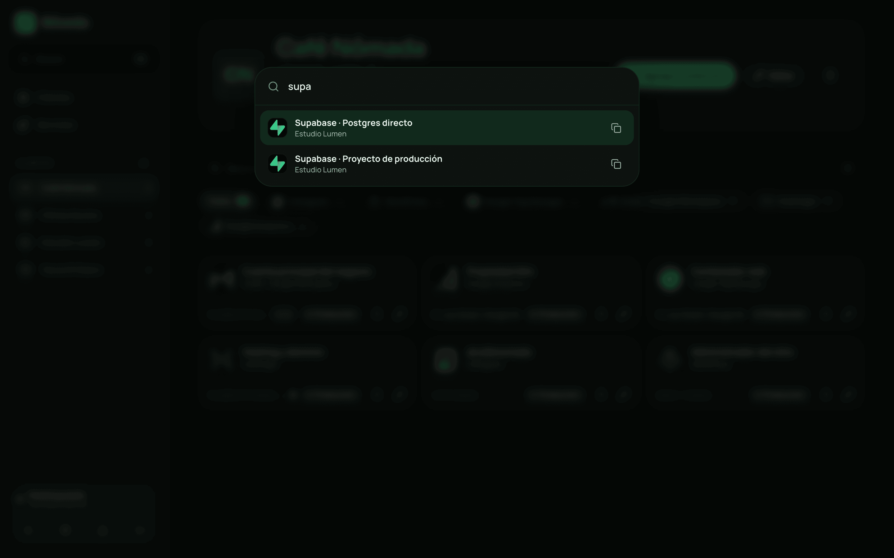
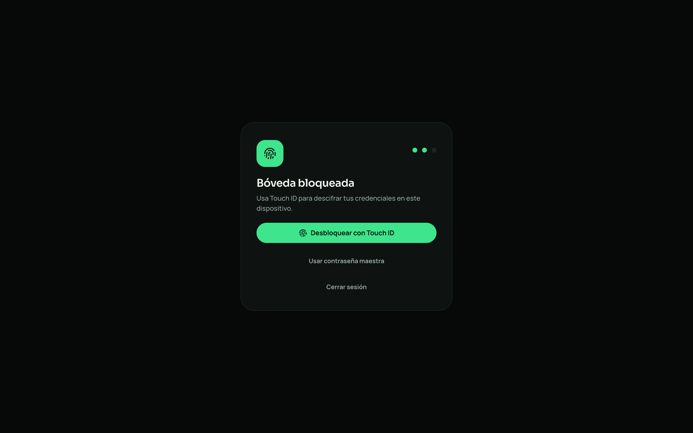
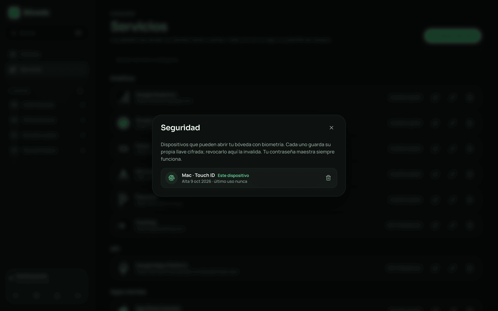
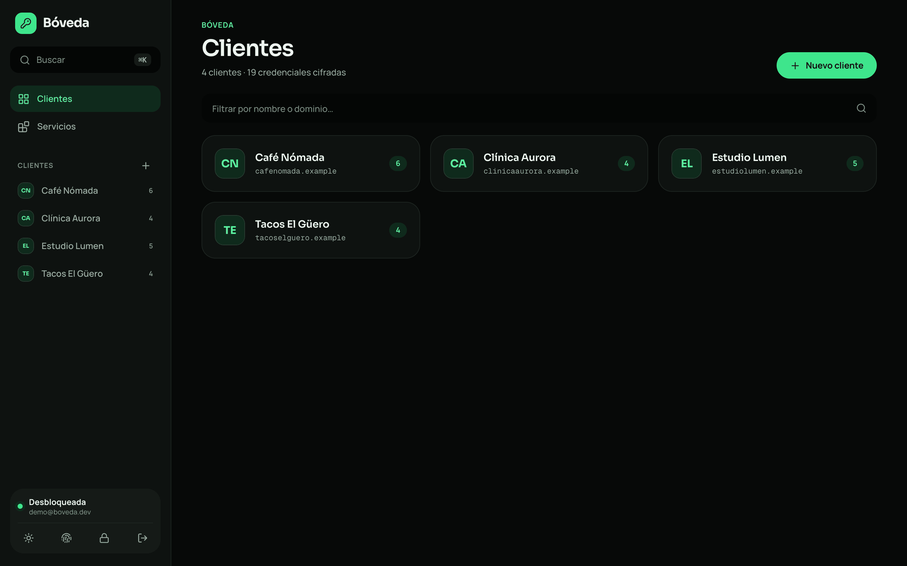
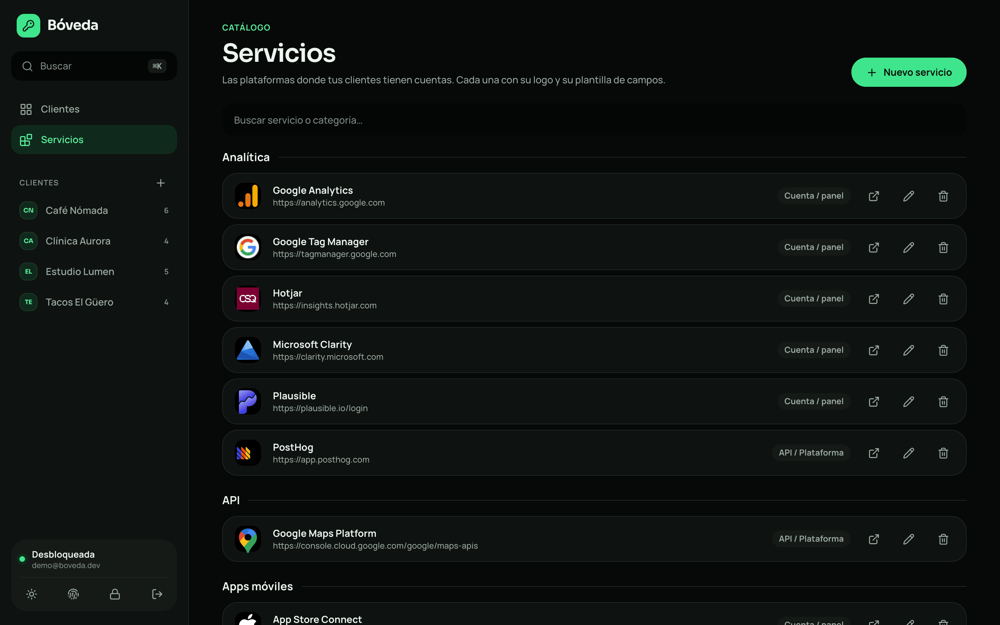
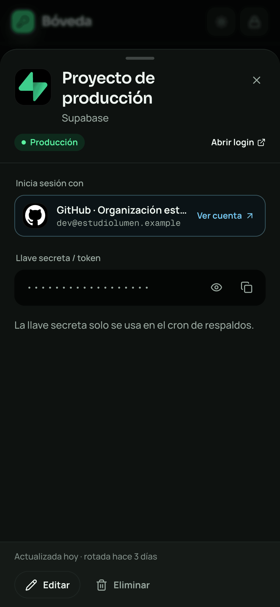
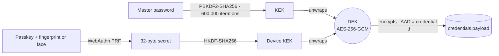

<div align="center">


# Bóveda

**Every client's credentials in one place, one shortcut away.**<br />
Encrypted before they leave your browser.

[](LICENSE)
[](https://github.com/yairhdz24/boveda7k/actions/workflows/ci.yml)


**[Website](https://getboveda.vercel.app/)** · **[Watch the 40-second video](https://getboveda.vercel.app/#top)** · **English** · [Español](README.es.md)



</div>

## The story

You freelance. You have a lot of clients, and each one comes with a Gmail account, a hosting panel, a Tag Manager container, a database and a server. You end up with one note per client, passwords buried in WhatsApp chats, and ten minutes lost every time you need to log in somewhere.

**Bóveda ("vault" in Spanish) does the opposite.** You create the client, link the accounts they have on any service, and every credential is one `⌘K` away. Everything is encrypted in your browser: neither the database nor whoever runs it can read a single password.

| Before | With Bóveda |
| --- | --- |
| A loose note per client | One client, all their accounts, with logo and environment |
| Passwords in WhatsApp chats and old emails | AES-256-GCM in your browser; the server only sees ciphertext |
| Ten minutes hunting for a login | `⌘K`, type two letters, copy |
| "Which email did I use for this?" | Linked accounts: *signs in with* the client's Google account |
| Typing the master password all day | Touch ID, Face ID or Windows Hello |

> The interface is in Spanish today. Translations are on the roadmap and very welcome.

## Screenshots

| | |
| --- | --- |
|  **One client, every login** |  **`⌘K`: search and copy without opening anything** |
|  **Biometric unlock** |  **Authorized devices, revocable** |
|  **Your clients** |  **180+ services with logo and field template** |

<div align="center">


**Installable as an app on your phone**
</div>

All screenshots use the fictional data from `npm run seed:demo`.

## Features

- **Clients** with logo, website and notes. Logos come from [SVGL](https://svgl.app), an upload, or the site's favicon.
- **Service catalog**: 180+ platforms (Google, Meta, Supabase, Vercel, Cloudflare, Hetzner, Stripe…) with login URL and a field template per kind: account, email, database, SSH server or API.
- **Credentials** per client and service, with environment (Production / Staging / Dev), free-form fields, a password generator and encrypted notes.
- **Linked accounts**: mark that Tag Manager "signs in with" the client's Gmail and the shortcuts copy the right username and password.
- **Side panel**: details slide in from the side (or from the bottom on mobile) without losing context.
- **Biometric unlock** with passkeys, without weakening the encryption ([how it works](#security-model)).
- **`⌘K` / `Ctrl K`**: search clients and credentials and copy a password without opening anything.
- **Automatic hygiene**: revealed values hide after 20 s, the clipboard clears after 30 s, the vault locks after 15 min idle, and credentials older than 90 days are flagged for rotation.
- **Dark and light themes**, installable as a PWA.

## Security model



- **Everything is encrypted in the browser.** Supabase only stores ciphertext: not the database, not a leaked backup, not the service role can read your passwords.
- **The data key (DEK) lives only in memory** and is non-extractable. Changing the master password only re-wraps the DEK; nothing is re-encrypted.
- **Biometrics are not an insecure shortcut.** Each device registers a passkey; when you verify, the authenticator releases a secret from which a key is derived to wrap the same DEK. Without the device and your fingerprint or face, that copy is useless. Revoking a device deletes its copy from the server.
- **There is no recovery if you forget the master password.** Store it outside the app.
- **What is not encrypted** (so it can be listed and filtered): the client's name, website and notes, the service name, and the credential's title, environment and login URL. Do not put secrets there.
- **RLS on every table**: each user only sees their own rows.
- **Hardened by default**: strict Content-Security-Policy, HSTS, no third-party scripts, and an icon fetcher that refuses private networks on every redirect hop. Dependabot and CodeQL watch the repo.

The full threat model and how to report a vulnerability are in [SECURITY.md](SECURITY.md).

## Quick start

You need Node 22+ and a Supabase project (the free plan is enough).

1. **Clone and install**
   ```bash
   git clone https://github.com/yairhdz24/boveda7k.git
   cd boveda7k
   npm install
   ```
2. **Create the database.** In your Supabase project, paste `supabase/migrations/0001_boveda.sql` and then `supabase/migrations/0002_passkeys.sql` into the SQL Editor. With the CLI: `supabase link --project-ref <ref> && supabase db push`.
3. **Create your user**: Authentication → Users → *Add user* (tick *Auto confirm*).
4. **Close public sign-ups**: Authentication → Sign In / Providers → turn off *Allow new users to sign up*.
5. **Environment variables**
   ```bash
   cp .env.example .env.local
   # NEXT_PUBLIC_SUPABASE_URL and NEXT_PUBLIC_SUPABASE_PUBLISHABLE_KEY (Project Settings → API)
   ```
6. **Run**
   ```bash
   npm run dev          # http://localhost:3000
   ```
   Sign in, create your master password and add your first client.

### No Supabase account: everything local

With Docker and the [Supabase CLI](https://supabase.com/docs/guides/cli):

```bash
supabase start        # starts Postgres + Auth and applies the migrations
```

Copy the `API URL` and `Publishable key` it prints into `.env.local`, create a user in Studio (`http://localhost:54323`) and run `npm run dev`.

### Sample data

```bash
# in .env.local: BOVEDA_DEMO_EMAIL, BOVEDA_DEMO_PASSWORD and BOVEDA_DEMO_MASTER
npm run seed:demo
```

Loads 4 fictional clients with 19 credentials, encrypted with the master password you provide. If the user already has clients, it does nothing.

## Deployment

Vercel, or your own server with `npm run build && npm start`. Always use HTTPS: Web Crypto, the clipboard and passkeys require it. If you host it on a VPS, also put it behind Cloudflare Access or an IP allowlist.

Biometric unlock is bound to the domain. If you change domains, sign in with your master password and register the device again.

### Biometric unlock compatibility

| Browser | Status |
| --- | --- |
| Safari 18+ (macOS 15, iOS 18) | Touch ID and Face ID |
| Chrome and Edge 116+ (macOS, Windows) | Touch ID and Windows Hello |
| Chrome on Android | Fingerprint |
| Browsers without the PRF extension | Not available; the master password works as usual |

## Project structure

```
supabase/migrations/0001_boveda.sql    tables, RLS, counts view, logo bucket
supabase/migrations/0002_passkeys.sql  passkeys for biometric unlock
src/lib/crypto.ts                      encryption (PBKDF2, HKDF, AES-GCM), password generator
src/lib/passkey.ts                     WebAuthn + PRF: the only file that touches navigator.credentials
src/lib/vault.tsx                      vault state, auto-lock, clipboard, toasts
src/lib/data.ts                        Supabase access (encrypts and decrypts credentials)
src/lib/presets.ts                     service catalog and SVGL search
src/components/CredentialCard.tsx      compact credential card
src/components/CredentialDrawer.tsx    side panel with the details
src/components/SecurityDialog.tsx      devices with biometric unlock
src/components/ui/                     Button, Field, SecretField, Dialog, Sheet…
src/app/tokens.css                     Bóveda Design System tokens
src/app/tailwind.css                   Tailwind v4 wired to those tokens
scripts/test-crypto.mts                encryption tests
scripts/seed-demo.mts                  sample data
docs/index.html + landing/             static landing page (GitHub Pages), no trackers
```

## Roadmap

- [ ] Export and restore an encrypted backup
- [ ] Share a client with a partner (wrap the DEK with their public key)
- [ ] Change history per credential
- [ ] Live TOTP codes
- [ ] Browser extension for autofill
- [ ] Interface in other languages (Spanish only today)
- [ ] Finish migrating styles to Tailwind + shadcn/ui

## Contributing

Contributions are welcome: new services for the catalog, translations, fixes and roadmap ideas. Start with [CONTRIBUTING.md](CONTRIBUTING.md) and read the [code of conduct](CODE_OF_CONDUCT.md). If you find a security issue, report it privately as described in [SECURITY.md](SECURITY.md).

## License

[MIT](LICENSE). Made in Mexico by Yair Hernandez.
